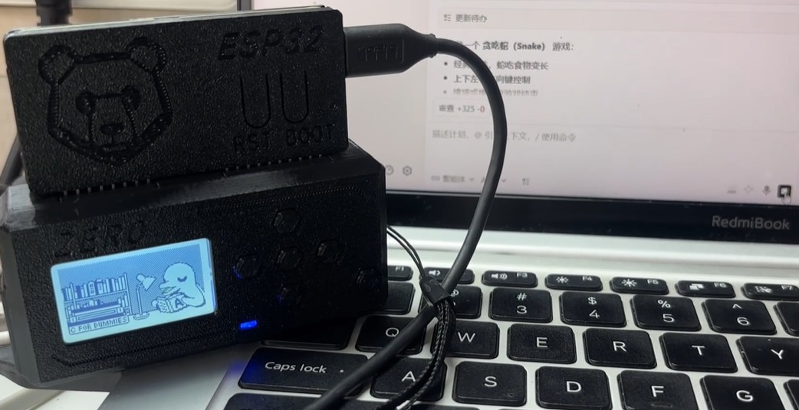

### 简介
使用Flipper作为人工智能助手工作状态的指示器。

### 快速获取
如果你需要fap文件，可以到dist目录下寻找。将文件放到Flipper的app目录下即可。

### 工作原理
项目使用的是Flipper的硬件UART接口，所以你需要一个WiFi Developer Board或者UART转USB的转换器。连接电脑后，会出现一个COM设备。

向此COM设备发送以下指令，Flipper就会发生状态转换，注意末尾加回车换行
"state thinking"
"state error"
"state running"
"state success"
"state idle"

### 这里提供一个给AI的指令示例。

从现在开始，你必须要记住，以后每次执行任务时，你需要执行下面这条指令，向我的COM设备报告你的状态信息，其中state success代表的是当前状态，另外还有"state error"，"state running"，"state success"，"state idle"，总共5种状态。这是指令：
powershell -Command "$p=new-Object System.IO.Ports.SerialPort COM11,230400,None,8,one;$p.Open();$p.WriteLine('state success');$p.Close()"

### 注意事项
设备连接到电脑后会出现COM编号，在上述例子里是COM11，如果不拔插或者更换USB口，这个编号一般不会变化，你需要根据自己的电脑修改这个编号。
我使用的是WiFi Developer Board，默认波特率支持230400，你需要根据自己需求进行修改。